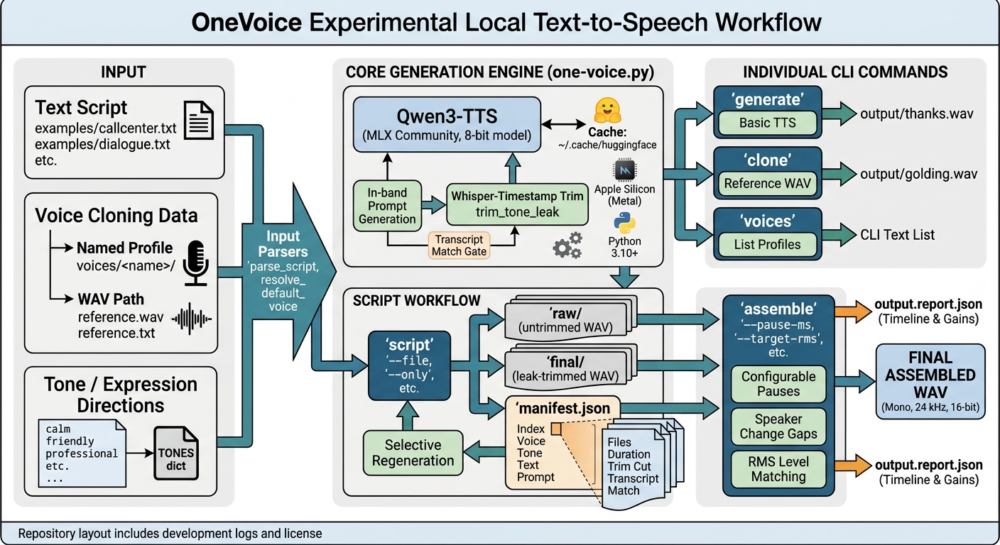

# OneVoice

Experimental local text-to-speech on Apple Silicon using
[Qwen3-TTS](https://huggingface.co/Qwen/Qwen3-TTS-12Hz-1.7B-Base) and
[MLX](https://github.com/ml-explore/mlx), with voice cloning from a short
reference recording — usable as a CLI and as an importable Python library.



The goal: natural, consistent, customer-quality voices where **who** is
speaking (voice), **how** they speak (tone), and **what** they say (text)
are controlled independently.

- **Voice cloning** — a named profile (`voices/<name>/`) or any reference WAV
  path; two public-domain LibriVox voices ship (`golding`, `neufeld`).
- **Tone / expression control** — 31 tones: 5 validated tags (`calm happy sad
  angry excited`) plus 26 natural-language directions (`friendly`,
  `professional`, `reassuring`, `sarcastic`, …).
- **Scripts** — each line of a script generates independently (`raw/` +
  `final/` + `manifest.json`), with single-line regeneration (`script --only`)
  and assembly into one WAV (`assemble`).
- **Embeddable** — `pip install` from this repo provides the `one-voice`
  command and an import-safe module (`parse_script`, `trim_tone_leak`, …).

See [DEVELOPMENT.md](DEVELOPMENT.md) for the full plan and
[development.log](development.log) for a chronological record of setup,
installation and configuration decisions.

## Requirements

- macOS on Apple Silicon (MLX requires Metal)
- Python 3.10+ (developed on 3.14)
- ~2.5 GB disk for the model (downloaded on first use, cached in
  `~/.cache/huggingface`)

## Setup

```bash
# Install from this repo as a package — provides the `one-voice` command:
pip install "git+https://github.com/simagix/one-voice.git"

# ...or run from a checkout:
git clone https://github.com/simagix/one-voice.git && cd one-voice
python -m venv .venv
.venv/bin/pip install -r requirements.txt   # mlx-audio, mlx-whisper, PyYAML

# Voice profiles: a checkout already ships voices/golding and voices/neufeld.
# A pip install does NOT ship voices/, so point the search path at your own
# directory (an override also works with a checkout):
#   export ONE_VOICE_DIR="$HOME/voices"       # single directory
#   export ONE_VOICE_PATH="/path/a:/path/b"   # colon-separated, leftmost wins
# Optional: default voice for script headers that omit one:
#   export ONE_VOICE=golding
```

## Usage

If you installed via pip, replace `.venv/bin/python one_voice.py` below with
`one-voice` — the commands are identical.

```bash
# Basic text-to-speech (no specific speaker)
.venv/bin/python one_voice.py generate \
    --text "Thank you for calling. How may I help you today?" \
    --output output/thanks.wav

# Voice cloning from a named profile (voices/<name>/voice.yaml)
.venv/bin/python one_voice.py voices                # list available profiles
.venv/bin/python one_voice.py clone \
    --voice golding \
    --text "Thank you for calling." \
    --output output/golding.wav

# ...or from an arbitrary reference WAV path
# (transcript is read from a <reference>.txt sidecar; override with --ref-text)
.venv/bin/python one_voice.py clone \
    --reference voices/golding/reference.wav \
    --text "Thank you for calling." \
    --output output/golding.wav

# Script support: each [voice | tone] block generates an independent WAV.
# Preview the plan without generating (rejects unknown voice/tone, malformed
# blocks, empty text) — recommended, since generation is ~5–9 s per line:
.venv/bin/python one_voice.py script \
    --file examples/callcenter.txt --output-dir output/script_callcenter --dry-run

# Generate: raw/ (untrimmed model output) + final/ (leak-trimmed) + manifest.json
# (per line: voice, tone, text, prompt, files, duration, trim + transcript match)
.venv/bin/python one_voice.py script \
    --file examples/callcenter.txt --output-dir output/script_callcenter

# Selective regeneration: regenerate ONLY line 2 and update manifest.json in
# place — all other clips and entries are kept untouched.
.venv/bin/python one_voice.py script \
    --file examples/callcenter.txt --output-dir output/script_callcenter --only 2

# Audio assembly: combine a script output dir's final/ segments into one mono
# 24 kHz 16-bit WAV. Configurable pauses (a longer gap on speaker change) and
# basic per-segment RMS level matching; --dry-run prints the timeline.
# Clips and manifest are never modified; <output>.report.json records the
# timeline and gains applied.
.venv/bin/python one_voice.py assemble \
    --manifest output/script_callcenter/manifest.json \
    --output output/script_callcenter/assembled.wav --dry-run
.venv/bin/python one_voice.py assemble \
    --manifest output/script_callcenter/manifest.json \
    --output output/script_callcenter/assembled.wav

# A multi-voice demo (two voices in one dialogue):
.venv/bin/python one_voice.py script \
    --file examples/dialogue.txt --output-dir output/dialogue_demo
.venv/bin/python one_voice.py assemble \
    --manifest output/dialogue_demo/manifest.json \
    --output output/dialogue_demo/assembled.wav

.venv/bin/python one_voice.py --version
.venv/bin/python one_voice.py --help
```

`generate`, `clone`, `script` and `assemble` all accept `--model` to override
the default model (`mlx-community/Qwen3-TTS-12Hz-1.7B-Base-8bit`). `assemble`
also takes `--pause-ms` (default 350), `--speaker-pause-ms` (default 600),
`--pause-after INDEX=MS` (per-gap micro-adjustments, e.g. `--pause-after
4=800` for a longer agent-handoff beat), `--target-rms` (default 0.08),
`--no-normalize` and `--source raw|final` (default final).

When a default voice is known — via `ONE_VOICE` or a checkout's first
profile — script headers may omit the `voice` part (`[tone: friendly]`);
see the script format below.

### Script format

Blocks are separated by blank lines; a block's first line is its header and
the remaining lines are its spoken text, joined onto one model input line.
`#` comments are allowed. Two header styles are accepted — the bare style
(`[voice]`, `[voice | tone]`) and the labeled style
(`[voice: NAME | tone: TAG]`) used by the deck-to-video integration, where
the `voice:`, `tone:`, or both parts may be omitted and filled from the
default voice:

```text
# comments allowed
[voice]                  # plain clone, no tone
[voice | tone]           # any of the 31 tones below
[voice: NAME | tone: TAG]  # labeled style; voice: and/or tone: optional
Spoken text, one or more lines (joined onto a single model input line).
```

Tones: `calm happy sad angry excited` are the 5 validated bracket tags; the
other 26 entries are natural-language directions (`friendly`, `professional`,
`reassuring`, `sarcastic`, `neutral`, `whisper`, `robotic`, …). The full
`TONES` dict with each prompt lives in `one_voice.py`. The tone prompt is
generated in-band on the same line as the text and the leaked prompt audio is
trimmed automatically (whisper word-timestamp method, Phases 3–6). Every
final clip is then whisper-transcribed as an objective gate; `manifest.json`
records each line (index, voice, tone, text, prompt, files, duration, trim cut,
transcript, `transcript_match`) — the source of truth for
selective regeneration (`script --only`) and for `assemble`.

`one_voice.py` is import-safe too — `parse_script`, `ScriptLine`,
`resolve_default_voice` and `trim_tone_leak` can be used from other Python
code (e.g. `lines = parse_script(source, default_voice="golding")`).

## Repository layout

```text
one_voice.py            CLI: generate / clone / voices / script / assemble / --version
                        Import-safe for embedding: parse_script, ScriptLine,
                        resolve_default_voice, trim_tone_leak
pyproject.toml          packaging — pip install from git, one-voice entry point
requirements.txt        runtime dependencies (mlx-audio, mlx-whisper, PyYAML)
examples/               example scripts for `script` (callcenter, two-voice demo)
voices/<name>/          voice profiles — reference.wav + reference.txt (+ voice.yaml
                        with name / reference / description)
experiments/            model and prompt experiments (see notes.md in each)
DEVELOPMENT.md          project plan, phases and evaluation criteria
development.log         chronological log of what was done (install/config reference)
VERSION                 current version (read by --version)
LICENSE                 Apache License 2.0
```

## Status

Phases 2–9 are complete and committed: voice cloning (`--reference` or a
named profile), tone/expression control (in-band prompt + whisper-timestamp
trim), a repeatable naturalness evaluation set, a two-voice set (the
public-domain LibriVox readers Neufeld and Golding), named voice profiles
(`--voice <name>` / `one_voice.py voices`), script generation (`one_voice.py
script`: per-line independent generation with optional tones, raw/final
preservation and a manifest), and audio assembly (`one_voice.py assemble`:
configurable pauses, a longer speaker-change gap, basic per-segment level
matching, single-line regeneration via `script --only`).

The package is pip-installable, importable as a library, and voice directories
are overridable via `ONE_VOICE_PATH` / `ONE_VOICE_DIR` (default voice via
`ONE_VOICE` or `parse_script(default_voice=…)`). The tone vocabulary and
labeled `[voice: NAME | tone: TAG]` headers are compatible with the
deck-to-video project's narration engine. See DEVELOPMENT.md for what is
deliberately **not** built yet (real-time call-center / speech-to-speech is
Phase 10); `development.log` records what was done and why.